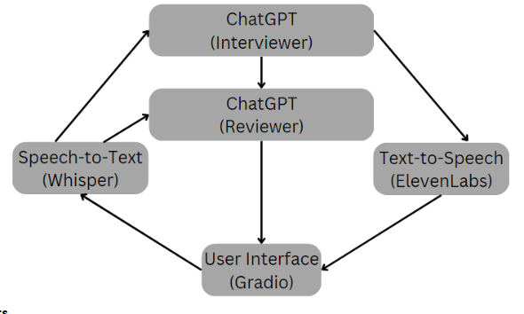

# Human-Resources-Interview-Assistant
This HR Interviewing assistant uses generative AI tools to replicate a behavioral interview similar to the first round of many job interviews. The chatbot will ask generic behavioral questions, the user records their response, and the reviewer provides useful feedback. 

This project uses LLMs, text-to-speech, and speech-to-text agents. There are two instances of ChatGPT running simultaneously; one acts as the interviewer(Bob) and provides generic behavioral questions when prompted. The other acts as an interview reviewer(Dan) that receives the user’s response and interview question to provide feedback. I used speech-to-text to allow the user to respond with an audio recording of their answer. This makes the interview to feel more realistic to simulate a real-world scenario. I feed both instances of ChatGPT the user’s transcribed question response, then have the interviewer generate a follow-up question. Additionally, I send the interviewer’s question to the reviewer to provide context on what to give feedback on. The interviewer reads off the next question using text-to-speech. Lastly, when the user is done with their mock interview, they can ask the interviewer to summarize their responses, which will prompt the feedback assistant to review and grade the interview as a whole. 

# Project Setup
Add the OpenAI and ElevenLabs API Keys asssociated with your account to the Interview_assistant.py. Then make sure the ChatGPT instaces are using a model allowed by your account by modifying the model value in Interview_assistant.py. 
 
